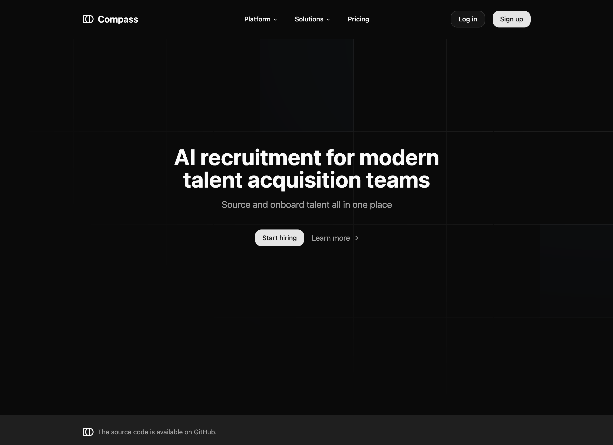

<a href="https://compass-hr.vercel.app">
  
  <h1 align="center">Compass</h1>
</a>

<p align="center">
  Realtime Voice AI Recruiter Built With Convex, Tanstack Start and OpenAI.
</p>

This project uses the [OpenAI Agents SDK](https://github.com/openai/openai-agents-js), a toolkit for building, managing, and deploying advanced AI agents. 

- Comprehensive candidate and jobs management with AI-powered workflows
- Multi-stage real-time AI voice interview system with seamless agent handoffs
- Public interview sharing with candidate onboarding flow and progress tracking
- AI-powered talent sourcing and matching with verified profiles
- Smart job creation with optimized descriptions and automated hiring pipelines
- Real-time transcript analysis and interview performance insights

> **NOTE:** ❗ This project is in very early development and lots of things will change.

<p align="center">
  <a href="#features"><strong>Features</strong></a> ·
  <a href="#model-provider"><strong>Model Provider</strong></a> ·
  <a href="#deploy-your-own"><strong>Deploy Your Own</strong></a> ·
  <a href="#running-locally"><strong>Running locally</strong></a>
</p>
<br/>

## Features

- [Tanstack Start](https://tanstack.com/start/latest)
  - File-based routing, type-safe from server to client
  - Built on Vite for a lightning-fast HMR development experience
- [OpenAI](https://openai.com/)
  - Leverages OpenAI's powerful models for generation.
  - Direct API calls for text generation and other AI features.
- [Shadcn/ui](https://ui.shadcn.com)
  - Styling with [Tailwind CSS](https://tailwindcss.com)
  - Component primitives from [Radix UI](https://radix-ui.com) for accessibility and flexibility
- [Convex](https://www.convex.dev/)
  - Real-time database for storing user profiles, job listings, and application data
  - Optimized file storage with automatic caching and CDN distribution
- [Convex Auth](https://labs.convex.dev/auth)
  - Simple and secure authentication without external services
  - Built-in support for magic links, OTPs, OAuth, and password authentication

## Model Provider

This app utilizes the [OpenAI API](https://openai.com/) for its AI capabilities. You will need to provide your own OpenAI API key in the environment variables.

## Deploy Your Own

You can deploy your own version of Compass to a hosting provider like Vercel or Netlify.

## Running locally

You will need to use environment variables to run Compass. It's recommended you use [Vercel Environment Variables](https://vercel.com/docs/projects/environment-variables) for this, but a local `.env` file is also sufficient.

> Note: You should not commit your `.env` file as it may expose secrets that could compromise your accounts.

1. Install dependencies:

```bash
bun install
```

2. If using Vercel for environment variables:
   a. Install Vercel CLI: `bun i -g vercel`
   b. Link local instance: `vercel link`
   c. Download environment variables: `vercel env pull`

3. Start the development server:

```bash
bun dev
```

Your app should now be running on [localhost:3000](http://localhost:3000/).
